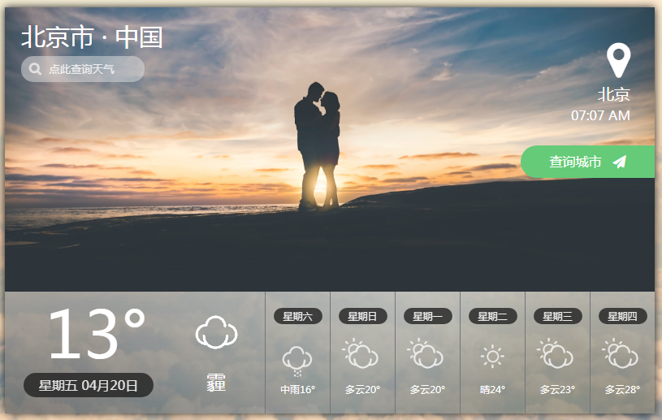

# 天气应用

一个网页天气应用。基于[魅族天气API](https://github.com/jokermonn/-Api/blob/master/MXWeather.md)实现地理定位、天气预报、市县级天气查询等功能。

背景图片来源于以下作者的无版权图片。

| 图片     | 来源                                       |
| ------ | ---------------------------------------- |
| 云端     | Photo by [Ryan Waring](https://unsplash.com/photos/gQrYB3j9mJ0?utm_source=unsplash&utm_medium=referral&utm_content=creditCopyText) on [Unsplash](https://unsplash.com/?utm_source=unsplash&utm_medium=referral&utm_content=creditCopyText) |
| 太空下的美国 | Photo by [NASA](https://unsplash.com/photos/1lfI7wkGWZ4?utm_source=unsplash&utm_medium=referral&utm_content=creditCopyText) on [Unsplash](https://unsplash.com/?utm_source=unsplash&utm_medium=referral&utm_content=creditCopyText) |
| 星空     | Photo by [Teddy Kelley](https://unsplash.com/photos/weuWmzv7xnU?utm_source=unsplash&utm_medium=referral&utm_content=creditCopyText) on [Unsplash](https://unsplash.com/?utm_source=unsplash&utm_medium=referral&utm_content=creditCopyText) |
| 早晨的情侣  | Photo by [frank mckenna](https://unsplash.com/photos/cRLEVt6SZxI?utm_source=unsplash&utm_medium=referral&utm_content=creditCopyText) on [Unsplash](https://unsplash.com/?utm_source=unsplash&utm_medium=referral&utm_content=creditCopyText) |

